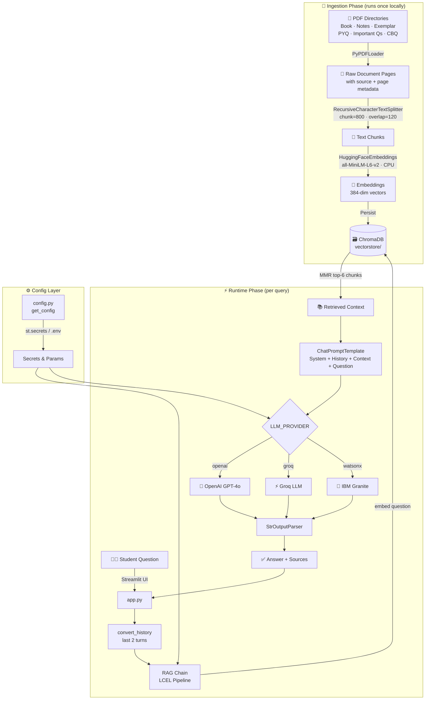
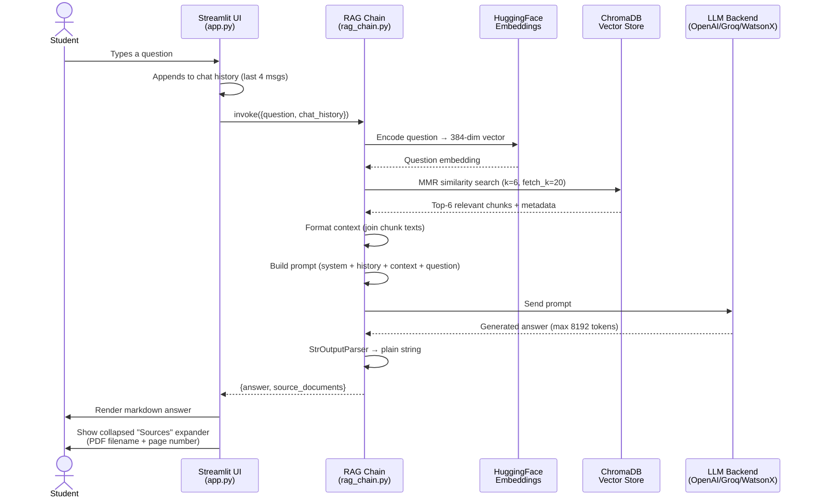

# Chemistry Tutor RAG Project — Architecture

> **Class 12 CBSE Chemistry AI Tutor** powered by Retrieval-Augmented Generation (RAG).
> Supports three interchangeable LLM backends: OpenAI GPT-4o, Groq, and IBM watsonx.ai (Granite).

---

## Table of Contents

1. [Project Overview](#1-project-overview)
2. [Repository Structure](#2-repository-structure)
3. [High-Level Architecture](#3-high-level-architecture)
4. [RAG Pipeline — How It Works](#4-rag-pipeline--how-it-works)
   - [Phase 1: Ingestion (Offline)](#phase-1-ingestion-offline)
   - [Phase 2: Retrieval & Generation (Runtime)](#phase-2-retrieval--generation-runtime)
5. [Flow Diagrams](#5-flow-diagrams)
   - [Diagram A — Overall System Architecture](#diagram-a--overall-system-architecture)
   - [Diagram B — RAG Query Flow (Step-by-Step)](#diagram-b--rag-query-flow-step-by-step)
6. [AI Tools & Libraries — Purpose & Connections](#6-ai-tools--libraries--purpose--connections)
7. [LLM Backend Options](#7-llm-backend-options)
8. [Configuration Reference](#8-configuration-reference)
9. [Data Sources](#9-data-sources)
10. [Deployment](#10-deployment)

---

## 1. Project Overview

This project is an **AI-powered Chemistry tutor** for Class 12 CBSE students preparing for the 2027 Board Exams. It uses a **Retrieval-Augmented Generation (RAG)** architecture to ground AI answers in the student's own study material — NCERT textbooks, class notes, NCERT Exemplar problems, important questions, and previous year question papers (PYQs).

**Key capabilities:**
- Answers chemistry questions anchored to NCERT syllabus and CBSE exam patterns
- Generates board-pattern MCQs, short-answer (SA-I/SA-II), case-based, and long-answer (LA) questions calibrated to authentic CBSE difficulty
- Explains concepts step-by-step with reactions, mechanisms, and SI-unit numericals
- Maintains multi-turn chat history (last 2 turns) to support follow-up questions
- Shows source document references (PDF file + page number) for every answer
- Supports swapping the LLM backend via a single environment variable (`LLM_PROVIDER`)

---

## 2. Repository Structure

```
Chemistry RAG Project/
│
├── chemistry_tutor/                  ← Main Python package
│   ├── __init__.py
│   ├── app.py                        ← Streamlit UI (entry point)
│   ├── config.py                     ← Central config + secret resolution
│   ├── ingest.py                     ← PDF ingestion & vector store build
│   ├── rag_chain.py                  ← LangChain LCEL RAG chain + LLM factory
│   └── vectorstore/                  ← Persisted ChromaDB (committed to repo)
│       └── chroma.sqlite3
│
├── Book/                             ← NCERT Class 12 Chemistry textbook PDFs
│   ├── lech1dd/                      ← Part 1 (Physical + Inorganic, Ch 1–5)
│   └── lech2dd/                      ← Part 2 (Inorganic + Organic, Ch 6–10)
│
├── Notes/                            ← CBSE revision notes per chapter
├── Exemplar/                         ← NCERT Exemplar PDFs per chapter
├── Important Questions/              ← Curated important questions per chapter
├── Competency Based Questions/       ← CBQ volumes (2023)
├── PYQ/                              ← Previous Year Question Papers (2014–2026)
│
├── requirements.txt                  ← Python dependencies
├── .env.example                      ← Environment variable template (no secrets)
├── .gitignore
└── ARCHITECTURE.md                   ← This file
```

---

## 3. High-Level Architecture

```
┌──────────────────────────────────────────────────────────────────────────┐
│                         STREAMLIT CLOUD / LOCAL                          │
│                                                                          │
│  ┌─────────────┐    ┌──────────────────┐    ┌────────────────────────┐  │
│  │   Student   │───▶│  Streamlit UI    │───▶│   RAG Chain (LCEL)     │  │
│  │  (Browser)  │◀───│   app.py         │◀───│   rag_chain.py         │  │
│  └─────────────┘    └──────────────────┘    └───────────┬────────────┘  │
│                                                          │               │
│                              ┌───────────────────────────┤              │
│                              ▼                           ▼               │
│                    ┌──────────────────┐      ┌─────────────────────┐   │
│                    │  ChromaDB        │      │   LLM Backend        │   │
│                    │  Vector Store    │      │  (OpenAI / Groq /    │   │
│                    │  (local disk)    │      │   IBM watsonx.ai)    │   │
│                    └──────────────────┘      └─────────────────────┘   │
│                            ▲                                             │
│                            │ (built once, offline)                      │
│                    ┌──────────────────┐                                 │
│                    │  Ingest Pipeline │                                 │
│                    │  ingest.py       │                                 │
│                    └──────────────────┘                                 │
│                            ▲                                             │
│                    ┌──────────────────┐                                 │
│                    │  PDF Documents   │                                 │
│                    │  (Book, Notes,   │                                 │
│                    │  Exemplar, PYQ,  │                                 │
│                    │  Important Qs,   │                                 │
│                    │  Competency Qs)  │                                 │
│                    └──────────────────┘                                 │
└──────────────────────────────────────────────────────────────────────────┘
```

---

## 4. RAG Pipeline — How It Works

### Phase 1: Ingestion (Offline)

This phase runs **once** locally before deployment. Its output (the `vectorstore/` directory) is committed to the repository so Streamlit Cloud can load it without re-processing.

```
PDF Files (7 directories)
       │
       ▼
  PyPDFLoader                     ← Extracts raw text + metadata (source, page)
       │
       ▼
  RecursiveCharacterTextSplitter  ← Splits pages into 800-char chunks,
       │                             120-char overlap, on "\n\n", "\n", ". "
       ▼
  HuggingFaceEmbeddings           ← Encodes each chunk into a 384-dim vector
  (all-MiniLM-L6-v2, CPU)         ← Runs locally — no API key needed
       │
       ▼
  ChromaDB (Persist)              ← Stores vectors + metadata to disk
  chemistry_tutor/vectorstore/
```

**Run ingestion locally:**
```bash
python -m chemistry_tutor.ingest
```

---

### Phase 2: Retrieval & Generation (Runtime)

Triggered on every student query inside the Streamlit app.

```
Student Question (text)
       │
       ▼
  HuggingFaceEmbeddings           ← Encodes question into the same 384-dim space
       │
       ▼
  ChromaDB MMR Retriever          ← Finds top-6 most relevant, diverse chunks
  (search_type="mmr", k=6,        ← MMR = Maximal Marginal Relevance
   fetch_k=20)                       reduces redundancy among retrieved docs
       │
       ▼
  Context Assembly                ← Joins chunk texts with "\n\n" separator
       │
       ▼
  ChatPromptTemplate              ← Assembles: System prompt + chat history
  + MessagesPlaceholder              + retrieved context + student question
       │
       ▼
  LLM (OpenAI / Groq / WatsonX)  ← Generates the answer
  temp=0.3, max_tokens=8192
       │
       ▼
  StrOutputParser                 ← Extracts plain string from LLM response
       │
       ▼
  Streamlit UI                    ← Renders markdown answer + source citations
```

---

## 5. Flow Diagrams

### Diagram A — Overall System Architecture



---

### Diagram B — RAG Query Flow (Step-by-Step)



---

## 6. AI Tools & Libraries — Purpose & Connections

| Tool / Library | Role | Connected To | Config Key |
|---|---|---|---|
| **`sentence-transformers/all-MiniLM-L6-v2`** | Embedding model. Converts text chunks and queries into 384-dimensional vectors. Runs **locally on CPU** — no API key required. | `ingest.py` → ChromaDB (build); `rag_chain.py` → ChromaDB (query) | `EMBEDDING_MODEL` |
| **`ChromaDB`** | Vector store. Persists embeddings to disk and performs MMR (Maximal Marginal Relevance) similarity search at query time. | `ingest.py` (write); `rag_chain.py` (read via LangChain retriever) | `VECTOR_STORE_DIR`, `RETRIEVER_TOP_K` |
| **`LangChain` (LCEL)** | Orchestration framework. Chains embedding → retrieval → prompt → LLM → parser into a single callable pipeline using the `\|` pipe operator. | All modules (`config`, `ingest`, `rag_chain`) | — |
| **`langchain-community` / `PyPDFLoader`** | PDF loader. Reads each PDF page as a `Document` object with `source` and `page` metadata fields. | `ingest.py` → `RecursiveCharacterTextSplitter` | — |
| **`RecursiveCharacterTextSplitter`** | Text chunker. Splits long PDF pages into 800-character chunks with 120-character overlap, preserving paragraph and sentence boundaries. | `ingest.py` → `HuggingFaceEmbeddings` | `CHUNK_SIZE`, `CHUNK_OVERLAP` |
| **`langchain-huggingface` / `HuggingFaceEmbeddings`** | Wraps the `sentence-transformers` model in a LangChain-compatible interface. Normalises embeddings for cosine similarity. | `ingest.py` (build store); `rag_chain.py` (retriever) | `EMBEDDING_MODEL` |
| **`ChatPromptTemplate` + `MessagesPlaceholder`** | Prompt construction. Assembles the system persona, rolling chat history, retrieved context, and the new question into a structured message list for the LLM. | `rag_chain.py` → LLM | — |
| **`OpenAI GPT-4o`** (`langchain-openai`) | Primary LLM backend. Generates Chemistry answers at `temperature=0.3`, `max_tokens=8192`. | `rag_chain.py` ← `LLM_PROVIDER=openai` | `OPENAI_API_KEY`, `OPENAI_MODEL` |
| **`Groq`** (`langchain-openai` with custom `base_url`) | Fast, free-tier LLM backend served via Groq's OpenAI-compatible API. Uses `gpt-oss-120b` by default. | `rag_chain.py` ← `LLM_PROVIDER=groq` | `GROQ_API_KEY`, `GROQ_MODEL` |
| **`IBM watsonx.ai / Granite`** (`langchain-ibm`) | Enterprise LLM backend. Uses IBM's Granite 3.x instruction-tuned model. Configured via IBM Cloud project + API key. | `rag_chain.py` ← `LLM_PROVIDER=watsonx` | `WATSONX_APIKEY`, `WATSONX_PROJECT_ID`, `WATSONX_MODEL_ID` |
| **`StrOutputParser`** | Output parser. Extracts the plain text string from the LLM's response object, regardless of which backend was used. | `rag_chain.py` → Streamlit UI | — |
| **`Streamlit`** | Web UI framework. Renders the chat interface, sidebar chapter navigation, study material links, and source expanders. Manages session state for chat history and the cached RAG chain. | `app.py` — top-level entry point | — |
| **`python-dotenv`** | Local secret loader. Reads a `.env` file for local development. Replaced by `st.secrets` on Streamlit Cloud. | `config.py`, `ingest.py` | — |

### Tool Connection Map

```
PDF Files
   └─[PyPDFLoader]──▶ Raw Docs
                          └─[RecursiveCharacterTextSplitter]──▶ Chunks
                                                                    └─[HuggingFaceEmbeddings]──▶ Vectors
                                                                                                     └─[ChromaDB.persist()]──▶ 🗃️ Vector Store

User Question
   └─[HuggingFaceEmbeddings]──▶ Query Vector
                                    └─[ChromaDB.mmr_search()]──▶ Top-6 Chunks
                                                                      └─[ChatPromptTemplate]──▶ Full Prompt
                                                                                                    └─[OpenAI/Groq/WatsonX LLM]──▶ Raw Response
                                                                                                                                        └─[StrOutputParser]──▶ Answer Text
                                                                                                                                                                   └─[Streamlit]──▶ 👨‍🎓 Student
```

---

## 7. LLM Backend Options

Three LLM backends are supported. Switch by setting `LLM_PROVIDER` in `.env` or Streamlit Cloud Secrets.

| Provider | Model | `LLM_PROVIDER` value | Cost | Notes |
|---|---|---|---|---|
| **OpenAI** | `gpt-4o` (default) | `openai` | Pay-per-token | Highest quality; requires billing |
| **Groq** | `openai/gpt-oss-120b` | `groq` | Free tier available | Very fast; rate-limited on free tier |
| **IBM watsonx.ai** | `ibm/granite-3-8b-instruct` | `watsonx` | IBM Cloud credits | Enterprise; requires project ID |

All three share the same LCEL chain structure — only the `_build_llm()` factory in [`rag_chain.py`](chemistry_tutor/rag_chain.py) differs.

---

## 8. Configuration Reference

All configuration is read by [`config.py`](chemistry_tutor/config.py) at runtime via the priority chain:
1. `st.secrets` — Streamlit Cloud deployment
2. `os.environ` / `.env` file — local development
3. Hardcoded default — fallback

| Variable | Default | Description |
|---|---|---|
| `LLM_PROVIDER` | `openai` | Which LLM to use: `openai`, `groq`, or `watsonx` |
| `OPENAI_API_KEY` | — | OpenAI API key |
| `OPENAI_MODEL` | `gpt-4o` | OpenAI model name |
| `GROQ_API_KEY` | — | Groq API key |
| `GROQ_MODEL` | `openai/gpt-oss-120b` | Groq model name |
| `WATSONX_API_KEY` | — | IBM watsonx.ai API key |
| `WATSONX_PROJECT_ID` | — | IBM Cloud project ID |
| `WATSONX_URL` | `https://us-south.ml.cloud.ibm.com` | watsonx.ai endpoint |
| `WATSONX_MODEL` | `ibm/granite-3-3-8b-instruct` | Granite model ID |
| `EMBEDDING_MODEL` | `sentence-transformers/all-MiniLM-L6-v2` | HuggingFace embedding model |
| `RETRIEVER_TOP_K` | `6` | Number of chunks returned per query |
| `CHUNK_SIZE` | `800` | Characters per chunk during ingestion |
| `CHUNK_OVERLAP` | `120` | Overlap characters between adjacent chunks |

See [`.env.example`](.env.example) for a full template.

---

## 9. Data Sources

All study material is stored as PDFs under the repository root and indexed into ChromaDB.

| Directory | Content | Chapters Covered |
|---|---|---|
| `Book/lech1dd/` | NCERT Class 12 Chemistry Part 1 | Ch 1–5 (Physical + Inorganic) |
| `Book/lech2dd/` | NCERT Class 12 Chemistry Part 2 | Ch 6–15 (Inorganic + Organic) |
| `Notes/` | CBSE revision notes | Ch 1–10 |
| `Exemplar/` | NCERT Exemplar problems & solutions | Ch 1–15 |
| `Important Questions/` | Curated important questions | Ch 1–10 |
| `Competency Based Questions/` | CBQ volumes (Vol 1 2023, Vol 2) | All chapters |
| `PYQ/` | CBSE Board papers | 2014–2026 |

---

## 10. Deployment

### Local Development

```bash
# 1. Clone repository
git clone <repo-url>
cd "Chemistry RAG Project"

# 2. Create virtual environment
python -m venv .venv
source .venv/bin/activate   # Windows: .venv\Scripts\activate

# 3. Install dependencies
pip install -r requirements.txt

# 4. Configure secrets
cp .env.example .env
# Edit .env and fill in your API key(s)

# 5. Build the vector store (first time only)
python -m chemistry_tutor.ingest

# 6. Run the app
streamlit run chemistry_tutor/app.py
```

### Streamlit Community Cloud

1. Push the repo (including `chemistry_tutor/vectorstore/`) to GitHub.
2. Create a new app on [streamlit.io/cloud](https://streamlit.io/cloud), pointing to `chemistry_tutor/app.py`.
3. Add secrets under **Settings → Secrets** (use the same key names as `.env.example`).
4. The pre-built vector store is loaded from the committed `vectorstore/` directory — no re-ingestion needed on the cloud.

> **Note:** Run `python -m chemistry_tutor.ingest` locally whenever new PDFs are added, then commit the updated `vectorstore/` directory before redeploying.
